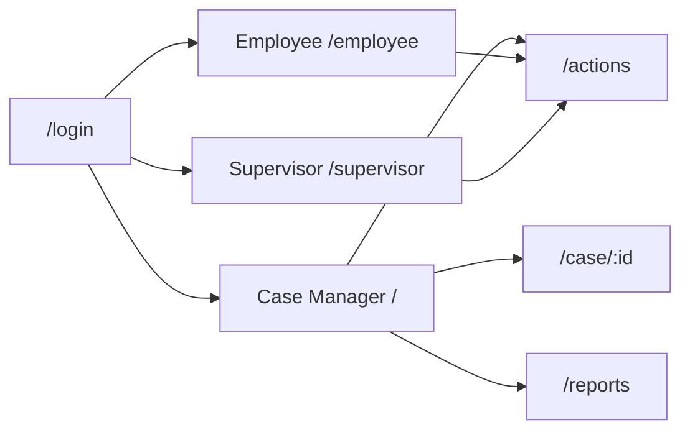

# Immidart Dashboard — UI Documentation

> **Version:** Prototype (static mock data)  
> **Last updated:** June 2026  
> **Audience:** Designers, frontend developers, product stakeholders

---

## Table of Contents

1. [Overview](#1-overview)
2. [Information Architecture](#2-information-architecture)
3. [Design System](#3-design-system)
4. [Layout & Navigation Patterns](#4-layout--navigation-patterns)
5. [Page Reference](#5-page-reference)
6. [Component Library](#6-component-library)
7. [UI Patterns](#7-ui-patterns)
8. [Authentication & Roles](#8-authentication--roles)
9. [Data & State](#9-data--state)
10. [Accessibility & Future Work](#10-accessibility--future-work)

---

## 1. Overview

**Immidart Dashboard** is a web application for immigration and cross-border mobility operations. It supports case managers, supervisors, and employees across six application modules: Assignments, Immigration, Travel, COC, LCA, and Invite Letter.

### Tech Stack

| Layer | Technology |
|-------|------------|
| Framework | TanStack Start (React 19, SSR-capable) |
| Routing | TanStack Router (file-based routes in `src/routes/`) |
| Styling | Tailwind CSS v4 + CSS custom properties |
| UI primitives | shadcn/ui (new-york style) on Radix UI |
| Icons | lucide-react |
| Build | Vite 7 via `@lovable.dev/vite-tanstack-config` |
| Deployment target | Cloudflare Workers |

### Current State

The UI is **fully designed and interactive** but uses **static mock data** throughout. No API calls or React Query hooks are wired to pages yet. Auth is simulated via `localStorage`.

---

## 2. Information Architecture

### Route Map

```
/login                          Sign in (role picker)
/                               Case Manager dashboard
/supervisor                     Supervisor dashboard (layout v1)
/supervisor2                    Supervisor dashboard (layout v2)
/employee                       Employee home (full)
/employee-lite                  Employee home (simplified landing)
/actions                        Action Center
/search?q=                      Global search results
/case/:caseId                   Case screening summary
/immigration                    Immigration operations dashboard
/assignment-request             New assignment wizard
/visa-guide                     Visa lookup tool
/profile                        Employee profile
/reports                        Reports hub
/reports/:appId                 Per-application saved reports
```

### Role-Based Entry Points

After sign-in, users are redirected by role:

| Role | Landing route |
|------|---------------|
| Case Manager | `/` |
| Supervisor | `/supervisor` |
| Employee | `/employee` |

### Application Modules

Six modules appear consistently as quick links, badges, and report categories:

| Module | Icon | Badge color |
|--------|------|-------------|
| Assignments | Briefcase | Blue |
| Immigration | Globe | Navy |
| Travel | Plane | Sky |
| COC | FileCheck | Emerald |
| LCA | Scale | Violet |
| Invite Letter | Mail | Teal |

Defined in `src/components/ApplicationBadge.tsx`.

### High-Level Flow



---

## 3. Design System

### Source Files

| File | Purpose |
|------|---------|
| `src/styles.css` | Design tokens, Tailwind theme, base styles |
| `components.json` | shadcn/ui configuration |
| `src/lib/utils.ts` | `cn()` helper (`clsx` + `tailwind-merge`) |

### Brand Colors

All brand tokens are defined as OKLCH CSS variables and exposed as Tailwind utilities.

| Token | Class | Usage |
|-------|-------|-------|
| `--brand-canvas` | `bg-brand-canvas` | Page background (warm off-white) |
| `--brand-navy` | `text/bg-brand-navy` | Headers, primary nav, emphasis |
| `--brand-blue` | `text/bg-brand-blue` | Links, active tabs, primary CTAs |
| `--brand-sky` | `text/bg-brand-sky` | Accents, filter panel tint |
| `--brand-orange` | `text/bg-brand-orange` | Logo accent, assignment highlights |
| `--brand-red` | `text/bg-brand-red` | Urgent / overdue states |
| `--brand-amber` | `text/bg-brand-amber` | SLA warnings, pending states |
| `--table-head` | `bg-table-head` | Table header rows |

### Semantic Tokens (shadcn)

Standard shadcn tokens are available: `background`, `foreground`, `primary`, `secondary`, `muted`, `accent`, `destructive`, `border`, `card`, `popover`, etc.

### Typography

- **Font stack:** `ui-sans-serif, system-ui, -apple-system, "Segoe UI", Roboto, sans-serif`
- **Logo wordmark:** `text-3xl font-bold` — "Immi" in `text-brand-blue`, "dart" in `text-brand-orange`
- **Section titles:** `text-base`–`text-lg font-bold text-brand-navy`
- **Field labels:** `text-xs font-semibold uppercase tracking-wide`
- **Micro copy / badges:** `text-[10px]`–`text-[11px]`

### Font Size Presets

Root font size can be scaled via `data-font-size` on `<html>`:

| Attribute | Root size | Effect |
|-----------|-----------|--------|
| `data-font-size="compact"` | 13px | ~81% scale |
| `data-font-size="default"` | 16px | 100% (default) |
| `data-font-size="large"` | 18px | ~112% scale |

> No UI control toggles this yet; it is available for future accessibility settings.

### Spacing & Layout

| Property | Value |
|----------|-------|
| Max content width | `1400px` (`max-w-[1400px]`) |
| Horizontal padding | `px-8` |
| Section vertical padding | `py-6` or `py-8` |
| Card border radius | `rounded-lg` (`--radius: 0.5rem`) |
| Common grid gaps | `gap-3`, `gap-4`, `gap-6` |

### Card Pattern

Standard content card:

```
bg-white rounded-lg shadow-sm border border-border p-5
```

KPI cards add a left accent border:

```
border-l-4 border-l-{color}
```

### Motion

- `animate-fade-in` — fade-in-up animation (0.35s cubic-bezier)
- `tw-animate-css` imported globally for additional utilities

### Theme

Light mode only. Dark mode CSS variant is defined but not applied. No theme toggle exists.

---

## 4. Layout & Navigation Patterns

### No Shared App Shell

There is **no global layout component**. Each page builds its own header and content area. Patterns are repeated consistently across routes.

### Standard Page Structure

```
┌─────────────────────────────────────────────────────────┐
│  HEADER (white, border-b-2 border-brand-navy)           │
│  Logo │ Toolbar: Search, CTAs, Profile                  │
├─────────────────────────────────────────────────────────┤
│  CONTENT (bg-brand-canvas, max-w-[1400px] mx-auto)      │
│                                                         │
│  [KPI cards] [Things to do] [Tables / modules]          │
│                                                         │
└─────────────────────────────────────────────────────────┘
                              ┌──────────────┐
                              │ Ask Immibro  │  ← fixed FAB
                              └──────────────┘
```

### Header Toolbar (Case Manager / Supervisor)

Typical right-side actions:

| Element | Component | Destination |
|---------|-----------|-------------|
| Create Request | `CreateRequestButton` | Dropdown → `/assignment-request` |
| Action Centre | `ActionCentreButton` | `/actions` (badge count) |
| Reports | `ReportsButton` | `/reports` |
| Search | Inline input | `/search?q=...` |
| Help | Popover | Visa Guide link, info links |
| Profile | Avatar circle | `/profile` |

### Sub-Navigation (Case / Immigration)

Navy tab bar pattern:

```
bg-brand-navy text-white
Active tab: bg-white text-brand-navy
```

### Floating Action Button

`AskImmibroButton` — fixed bottom-right (`bottom-6 right-6 z-40`), blue pill labeled "Ask Immibro". Present on main dashboards; no chat UI is wired.

---

## 5. Page Reference

### `/login` — Sign In

**File:** `src/routes/login.tsx`

| Element | Description |
|---------|-------------|
| Layout | Centered card on canvas background |
| Fields | Email, password, role select |
| Roles | Case Manager, Employee, Supervisor |
| Validation | Hardcoded demo credentials |
| On success | Role-based redirect |

---

### `/` — Case Manager Dashboard

**File:** `src/routes/index.tsx`  
**Auth:** Required (`RequireAuth`)

| Section | Description |
|---------|-------------|
| KPI grid | 3×2 stat cards — overdue, SLA, approvals, pending by module |
| Things to do | Task list with `ApplicationBadge`, due dates, action buttons |
| Quick links | 6 application module buttons |
| All Cases table | Tabs: Ongoing / Nearing SLA / Pending approval |
| Filters | Popover (country, visa type, sort) |
| KPI drill-down | Clicking a KPI opens a **Sheet** with case table |
| Pagination | Client-side page controls |

---

### `/supervisor` — Supervisor Dashboard v1

**File:** `src/routes/supervisor.tsx`

| Section | Description |
|---------|-------------|
| My Assignment | `MyAssignmentCard` — destination, % complete, action needed |
| KPI row | 4 stat cards |
| Things to do | Tabs: Approvals / Clarifications |
| Help & Resources | 3-column hero cards |
| Applications strip | 6 module quick links |
| Team Cases | Tabbed table with filters |
| Alerts | Button opens **Sheet** with alert list |

---

### `/supervisor2` — Supervisor Dashboard v2

**File:** `src/routes/supervisor2.tsx`

Layout variant of supervisor dashboard:

| Difference from v1 |
|--------------------|
| 3-column hero: KPIs + Help \| Things to do \| Inline assignment journey (5 steps) |
| Assignment journey shown inline instead of `MyAssignmentCard` |
| Otherwise similar team cases and alerts |

---

### `/employee` — Employee Home (Full)

**File:** `src/routes/employee.tsx`

| Section | Description |
|---------|-------------|
| Urgent banner | Red callout for time-sensitive actions |
| Assignment journey | 5-step progress (Initiated → Documents → Filing → Decision → Active) |
| Things to do | Tabs: My tasks / Approvals / Clarifications |
| Applications | Grid of module cards |
| Case listing | Expandable assignments → child cases |
| Help resources | Linked cards |
| Alerts | **Sheet** panel |

---

### `/employee-lite` — Employee Home (Simplified)

**File:** `src/routes/employee-lite.tsx`  
**Auth:** Required

| Section | Description |
|---------|-------------|
| Background | Hero image (`employee-lite-bg.jpg`) |
| Copy | WorkAbroad introduction text |
| CTAs | Create Request, Ask Immibro, Visa Guide, ServiceNow (placeholder) |

---

### `/actions` — Action Center

**File:** `src/routes/actions.tsx`

| Section | Description |
|---------|-------------|
| Summary | Cases actioned count |
| Your Assignment | Collapsible task list |
| Quick filters | Left sidebar (`bg-brand-sky/20`) |
| Main table | Tabs: All / Approvals / Clarifications; sortable columns |
| Advance filter | **Dialog** — date ranges, selects, saved searches |
| Personal todos | **Sheet** with assignee picker (Avatar) |
| Pagination | 8 rows per page |

---

### `/search` — Global Search

**File:** `src/routes/search.tsx`

| Element | Description |
|---------|-------------|
| Query param | `?q=` search string |
| Results | Filtered case list (name, route, dates) |
| Links | Each result links to `/case/:caseId` |

---

### `/case/:caseId` — Case Screening Summary

**File:** `src/routes/case.$caseId.tsx`

| Section | Description |
|---------|-------------|
| Tab nav | Scrollable navy horizontal tabs |
| Summary card | Collapsible — route flags, metadata grid, Approve/Reject |
| Quick links | 15 buttons (Documents, Letters, etc.) |
| Persistence | Collapse state saved to `localStorage` |

---

### `/immigration` — Immigration Operations

**File:** `src/routes/immigration.tsx`

| Section | Description |
|---------|-------------|
| Module tabs | Immigration-specific navigation |
| Filters | Screener, geo, country, request type, search |
| Stat cards | 5 operational KPIs |

---

### `/assignment-request` — New Assignment Wizard

**File:** `src/routes/assignment-request.tsx`

| Step | Content |
|------|---------|
| 1 — Questionnaire | Employee info, country, policy, dates |
| 2 — Select Service | Service picker |
| Controls | Horizontal stepper, Cancel / Proceed / Submit |
| Date picker | Calendar in Popover |

---

### `/visa-guide` — Visa Lookup

**File:** `src/routes/visa-guide.tsx`

| Element | Description |
|---------|-------------|
| Comboboxes | 3 searchable selects: From country, To country, Visa type |
| Implementation | Command + Popover pattern |

---

### `/profile` — Employee Profile

**File:** `src/routes/profile.tsx`  
**Auth:** Required

| Section | Description |
|---------|-------------|
| Section nav | Blue tabs: MY PROFILE / PORTAL / KNOWLEDGE BASE |
| Left panel | Avatar + 7 category icon grid |
| Right panel | Organization info definition list |

---

### `/reports` — Reports Hub

**File:** `src/routes/reports.tsx`  
**Auth:** Required

| Element | Description |
|---------|-------------|
| Grid | 6 application cards with saved-report counts |
| Navigation | Each card links to `/reports/:appId` |

---

### `/reports/:appId` — Per-App Reports

**File:** `src/routes/reports.$appId.tsx`  
**Auth:** Required

| Element | Description |
|---------|-------------|
| Table | Saved reports list |
| Add report | **Dialog** — name + format (PDF / XLSX / CSV) |
| Actions | View, download, delete (client-side state) |
| Data | `src/data/reportApplications.ts` |

---

## 6. Component Library

### Domain Components (`src/components/`)

| Component | File | Purpose |
|-----------|------|---------|
| `ApplicationBadge` | `ApplicationBadge.tsx` | Colored pill identifying application module on tasks |
| `ActionCentreButton` | `ActionCentreButton.tsx` | Navy link to `/actions` with red badge count |
| `CreateRequestButton` | `CreateRequestButton.tsx` | Green dropdown — International Assignment / Business Visa |
| `ReportsButton` | `ReportsButton.tsx` | Outlined link to `/reports` |
| `AskImmibroButton` | `AskImmibroButton.tsx` | Fixed bottom-right FAB |
| `MyAssignmentCard` | `MyAssignmentCard.tsx` | Orange-bordered assignment summary (supervisor v1) |
| `RequireAuth` | `RequireAuth.tsx` | Client-side auth gate → redirect to `/login` |

### shadcn/ui Components (`src/components/ui/`)

47 primitives installed (new-york style). **Used in routes:**

| Component | Used on |
|-----------|---------|
| `button`, `label`, `input`, `select` | Login, dashboards, actions, reports, forms |
| `popover` | Filters, help menus, date pickers, visa guide |
| `sheet` | KPI drill-down, alerts, todos |
| `tabs` | Supervisor, employee dashboards |
| `tooltip` | Supervisor, employee dashboards |
| `dialog` | Advance filter, new report |
| `calendar` | Actions, assignment request |
| `command` | Visa guide comboboxes |
| `avatar` | Action Center assignee picker |

**Installed but unused in routes:** accordion, alert, badge, breadcrumb, card, carousel, chart, checkbox, collapsible, drawer, dropdown-menu, form, hover-card, pagination (component), progress, radio-group, scroll-area, separator, sidebar, skeleton, slider, sonner, switch, table, textarea, toggle, and others.

---

## 7. UI Patterns

### KPI Stat Card

```
┌─ red/amber/blue/green accent (border-l-4)
│  Label (text-xs uppercase)
│  04  (text-3xl font-bold)
│  [Needs attention] (badge pill)
└─────────────────────────────────
```

Clickable KPIs open a **Sheet** with a filtered case table.

### Things to Do Task Row

| Element | Style |
|---------|-------|
| Application badge | `ApplicationBadge` component |
| Urgent label | Red text when applicable |
| Due date | Small muted text |
| Case link | `text-brand-blue underline` |
| Action button | Red if urgent, blue otherwise |

### Data Tables

Custom `<table>` markup (not shadcn `Table`):

| Property | Class |
|----------|-------|
| Header row | `bg-table-head/60 text-brand-navy` |
| Row hover | `hover:bg-accent/40` |
| Sortable columns | Chevron buttons + `useState` sort |
| Case links | `text-brand-blue underline` |

### Status Pills

Per-route `StatusPill` functions map status strings to Tailwind color classes (e.g. emerald for approved, amber for pending).

### Filters

| Type | Implementation | Where |
|------|----------------|-------|
| Inline popover | Popover + Select | Dashboards |
| Quick filter sidebar | Tinted panel | Action Center |
| Advance filter | Dialog + Calendar + Select | Action Center |
| Search combobox | Command in Popover | Visa Guide |

### Overlays

| Pattern | Component | Use cases |
|---------|-----------|-----------|
| Side panel | `Sheet` (slides from right) | KPI drill-down, alerts, todos |
| Modal | `Dialog` | Advance filter, create report |
| Dropdown | Popover or custom div | Create Request, Help menu |

### Assignment Journey Stepper

5 steps with numbered circles and connecting lines:

```
Initiated → Documents → Filing → Decision → Active
```

Used on employee dashboard and supervisor v2.

### Wizard Stepper

Horizontal numbered steps on `/assignment-request` (Questionnaire → Select Service).

---

## 8. Authentication & Roles

### Implementation

| File | Role |
|------|------|
| `src/lib/auth.ts` | `setAuth`, `getAuth`, `clearAuth` — `localStorage` key `immidart_auth_role` |
| `src/components/RequireAuth.tsx` | Wraps protected routes; shows "Checking session…" while loading |

### Protected Routes

- `/`
- `/profile`
- `/reports`, `/reports/:appId`
- `/employee-lite`

All other routes are accessible without auth.

### Demo Credentials

Configured in `src/routes/login.tsx` (email + password validation before role redirect).

### Gaps

- No logout UI
- `clearAuth()` exists but is not called from any route
- No session expiry or token handling

---

## 9. Data & State

### Data Sources

| Source | Used for |
|--------|----------|
| Inline constants in route files | Stats, tasks, cases, alerts |
| `src/data/reportApplications.ts` | Report apps and seed saved reports |
| Component-local static data | `MyAssignmentCard`, `ActionCentreButton` count |

### Client State

| Mechanism | Usage |
|-----------|-------|
| `useState` | Tabs, filters, pagination, sheet/dialog open, sort |
| TanStack Router | `useNavigate`, `useSearch`, `useParams` |
| `localStorage` | Auth role, case summary collapse preference |

### React Query

`QueryClient` is provided at root (`src/router.tsx`, `src/routes/__root.tsx`) but **no queries are defined** yet.

### Filtering Behavior

| Route | Behavior |
|-------|----------|
| `/search` | Filters mock results by query string |
| `/employee` | Filters assignments by `caseQuery` |
| `/actions` | Tab filter + sort + pagination |
| Dashboard filters | UI present; **not wired to data** in all cases |

---

## 10. Accessibility & Future Work

### Current Accessibility

- `aria-label` on some icon-only buttons
- Loading state text in `RequireAuth`
- Font-size CSS presets (not exposed in UI)
- Semantic form labels on login and wizards

### Recommended Next Steps

| Area | Recommendation |
|------|----------------|
| Data layer | Wire React Query hooks; replace inline mock constants |
| Auth | Add logout, session handling, route guards on all sensitive pages |
| Layout | Extract shared `AppHeader` to reduce duplication |
| Filters | Connect filter UI to actual data filtering |
| Charts | Use `chart.tsx` + Recharts where KPI trends are needed |
| Toasts | Integrate `sonner` for action feedback |
| Dark mode | Enable theme toggle if required |
| Ask Immibro | Build chat/assistant panel behind FAB |
| Sidebar | Use shadcn `sidebar.tsx` or remove if unused |
| Forms | Adopt react-hook-form + zod for complex wizards |
| Font size | Add settings control for `data-font-size` attribute |

---

## Appendix: File Index

| Area | Path |
|------|------|
| Global styles | `src/styles.css` |
| shadcn config | `components.json` |
| Route tree (generated) | `src/routeTree.gen.ts` |
| Root shell / errors | `src/routes/__root.tsx` |
| Auth utilities | `src/lib/auth.ts` |
| Report seed data | `src/data/reportApplications.ts` |
| Utils (`cn`) | `src/lib/utils.ts` |
| All pages | `src/routes/*.tsx` |
| Domain components | `src/components/*.tsx` |
| UI primitives | `src/components/ui/*.tsx` |

---

*This document reflects the codebase as of the prototype phase. Update it when API integration, auth hardening, or layout refactors land.*
